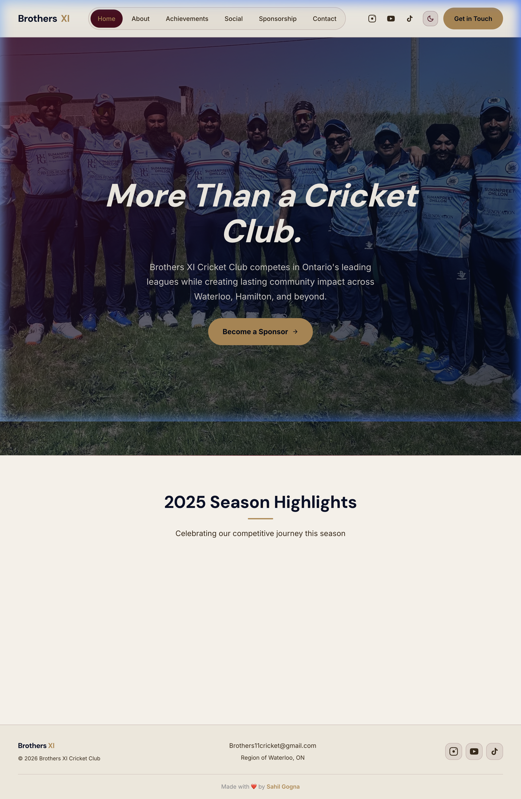
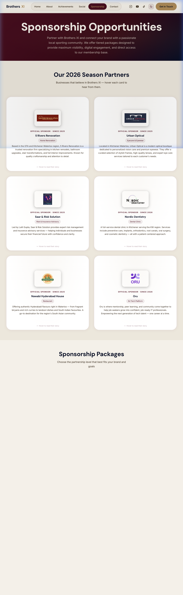
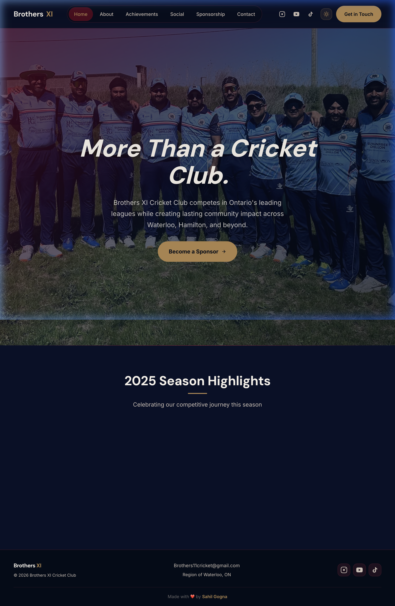
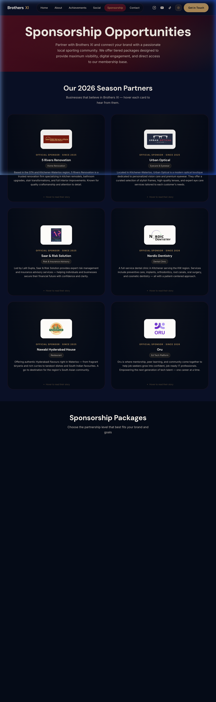

# Brothers XI Cricket Club — Portfolio Website

Official website for **Brothers XI Cricket Club**, a family-oriented cricket club based in the Region of Waterloo, Ontario. Built with React + Vite.

---

## 🌗 Theme Preview

### ☀️ Light Mode
| Home | Sponsorship |
|---|---|
|  |  |

### 🌙 Dark Mode
| Home | Sponsorship |
|---|---|
|  |  |

---

## 🏏 Pages

| Page | Description |
|---|---|
| **Home** | Hero section, club highlights, match results |
| **About** | Club story, leagues, leadership team |
| **Achievements** | Trophies, milestones, season highlights |
| **Social** | Embedded YouTube videos & Instagram reels |
| **Sponsorship** | 2026 season partners (flip cards) + available sponsorship packages |
| **Contact** | Inquiry form powered by Formspree |

---

## ✨ Features

- **Light / Dark theme toggle** — preference persisted via `localStorage`, light mode default
- **2026 Sponsor flip cards** — logo + description on front, testimonial on hover/flip
- **"Slot Filled" indicator** — visual ribbon + disabled CTA for taken sponsorship tiers
- **GSAP animations** — scroll-triggered entrances across all pages
- **Fully responsive** — mobile-first layout

---

## 🛠 Tech Stack

- **React 18** + **Vite**
- **React Router v6**
- **GSAP** + ScrollTrigger
- **Formspree** (contact & sponsorship forms)
- **DM Sans** + **Inter** (Google Fonts)
- **Vanilla CSS** with CSS custom properties for theming

---

## 🚀 Running Locally

```bash
npm install
npm run dev
```

Open [http://localhost:5173](http://localhost:5173)
